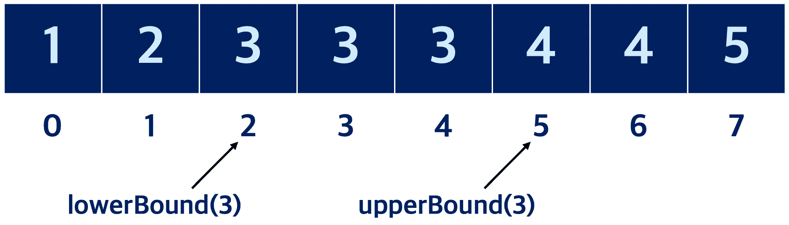

# 이진 탐색 알고리즘
---
📒 목차
- [이진 탐색 알고리즘](#이진-탐색-알고리즘)
  - [순차탐색 vs 이진탐색](#순차탐색-vs-이진탐색)
    - [코드 예시](#코드-예시)
  - [특정 원소의 개수 구하기](#특정-원소의-개수-구하기)
    - [코드 예시](#코드-예시-1)
  - [파라메트릭 서치](#파라메트릭-서치)
    - [코드예시](#코드예시)
---
## 순차탐색 vs 이진탐색
- 순차탐색
  - 배열에 특정값을 찾기 위해 `앞에서 부터 하나씩 확인`한다
  - 값이 12인 원소의 위치를 찾는 방법
  - ex) [0,2,4,6,8,10,`12`,14,16,18]
    --------------------->
  - 시간 복잡도 : O(N)

- 이진 탐색
  - **정렬**되어 있는 배열에서 탐색범위를 `절반씩 좁혀가며` 데이터를 탐색한다 (분할정복)
  - 시간 복잡도 : O($\log N$)
  - ex) 값이 46인 원소의 위치를 찾는 방법
  - 시작점(left) 끝점(end)를 기준으로 `탐색범위` 명시
  

  - 사용사례
    1. 매우 넓은(억 단위 이상) 탐색 범위에서 최적의 해를 찾아야 하는 경우
    2. 데이터를 정렬한 뒤 다수의 쿼리를 날려야 하는 경우

<br />

### 코드 예시
```javascript
/**
 * @description 재귀함수를 활용한 이진탐색 구현
 * @param {number[]} arr
 * @param {number} target
 * @param {number} left
 * @param {number} right
 * @returns {number}
 */
function binarySearchByRecursion(arr, target, left, right) {
  if (left > right) return -1;
  let mid = ((left + right) / 2) >> 0;
  if (arr[mid] === target) return mid;
  else if (arr[mid] > target)
    return binarySearchByRecursion(arr, target, left, mid - 1);
  else return binarySearchByRecursion(arr, target, mid + 1, right);
}

/**
 * @description 반복문을 활용한 재귀함수 구현
 * @param {number[]} arr
 * @param {number} target
 * @returns {number}
 */
function binarySearchByLoop(arr, target) {
  let left = 0;
  let right = arr.length;
  while (left <= right) {
    const mid = ((left + right) / 2) >> 0;
    if (target === arr[mid]) return mid;
    arr[mid] > target ? (right = mid - 1) : (left = mid + 1);
  }
  return -1;
}
```
---
## 특정 원소의 개수 구하기
이진 탐색을 활용하여 특정 원소의 개수를 빠르게 구할 수 있다
C++ 에서 기본적으로 제공하는 `lowerBound()`와 `upperBound()`활용 할 수 있다
(파이썬 : `bisect_left()`, `bisect_right()`)
- `lowerBound(arr,x)`: 정렬된 순서를 유지하면서 배열 arr에 x를 넣을 가장 왼쪽 인덱스
- `upperBoudn(arr,x)`: 정렬된 순서를 유지하면서 배열 arr에 x를 넣을 가장 오른쪽 인덱스


* 특정 원소의 가장 왼쪽 인덱스와 가장 오른쪽 인덱스를 활용하여 배열에 특정 원소의 개수를 알 수 있다
* `countByRange()`: 정렬된 배열에서 값이 `특정 범위에 속하는 원소의 개수`를 계산한다


### 코드 예시
```javascript

/**
 * @description 정렬된 순서를 유지하면서 배열에 삽입 할 가장 왼쪽 인덱스 반환
 * @param {number[]} arr
 * @param {number} target
 * @returns {number}
 */
function lowerBound(arr, target) {
  let left = 0;
  let right = arr.length;
  while (left < right) {
    const mid = ((left + right) / 2) >> 0;
    if (arr[mid] >= target) right = mid; // 최대한 왼쪽으로 이동하기
    else left = mid + 1; 
  }
  return right;
}

/**
 * @description 정렬된 순서를 유지하면서 배열에 삽입 할 가장 오른쪽 인덱스 반환
 * @param {number[]} arr
 * @param {number} target
 * @returns
 */
function upperBound(arr, target) {
  let left = 0;
  let right = arr.length;
  while (left < right) {
    const mid = ((left + right) / 2) >> 0;
    if (arr[mid] > target) right = mid; // 최대한 오른쪽으로 이동하기
    else left = mid + 1;
  }
  return right;
}

/**
 * @description left <= x <= right 인 원소의 개수를 반환하는 함수
 * @param {number[]} arr
 * @param {number} left
 * @param {number} right
 * @returns {number}
 */
function countByRange(arr, left, right) {
  const rightIndex = upperBound(arr, right, 0, arr.length);
  const leftIndex = lowerBound(arr, left, 0, arr.length);
  return rightIndex - leftIndex;
}
```
<!-- TODO -->
<!-- ## 파라메트릭 서치 이해하기 -->
---
## 파라메트릭 서치
최적화 문제를 `결정문제('예' or '아니오')`로 바꾸어 해결하는 기법
  - ex) 특정 조건을 만족하는 가장 알맞은 값을 빠르게 찾는 `최적화` 문제
일반적으로 파라메트릭 서치 문제는 `이진 탐색`을 이용하여 해결 가능


### 코드예시
- 백준 : 예산
- https://www.acmicpc.net/problem/2512
[문제설명-바로가기](../%EB%B0%B1%EC%A4%80/silver2/%EC%98%88%EC%82%B0/%EC%98%88%EC%82%B0.md)
```javascript
const input = `5
70 80 30 40 100
450`.split("\n");

const N = +input[0];
const arr = input[1].split(" ").map(Number);
const M = +input[2];

let left = 0;
let right = arr.reduce((ac, cu) => Math.max(ac, cu), 0);
let answer = 0;
while (left <= right) {
  const mid = ((left + right) / 2) >> 0;
  const totalPrice = arr.reduce((ac, cu) => ac + Math.min(cu, mid), 0);
  if (totalPrice <= M) {
    left = mid + 1;
    answer = mid;
  } else {
    right = mid - 1;
  }
}

console.log(answer);

```